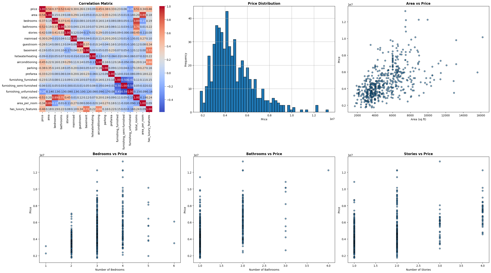

# House-Price-Prediction-using-Linear-Regression
House price prediction model using Linear Regression with feature engineering, encoding, and data visualization. Achieved R² = 0.65.
# 🏠 House Price Prediction using Linear Regression

## 📌 Overview
This project aims to predict house prices using a Linear Regression model. It involves data preprocessing, feature engineering, and exploratory data analysis to build an accurate and interpretable model.

---

## ⚙️ Technologies Used
- Python
- Pandas
- NumPy
- Scikit-learn
- Matplotlib
- Seaborn
- Joblib

---

## Dataset

The project uses the `Housing.csv` dataset containing real estate data with the following features:

- `price`: Price of the house (target variable)
- `area`: Area in square feet
- `bedrooms`: Number of bedrooms
- `bathrooms`: Number of bathrooms
- `stories`: Number of floors
- `mainroad`, `guestroom`, `basement`, `hotwaterheating`, `airconditioning`, `prefarea`, `furnishingstatus`: Categorical features representing house amenities
- `parking`: Number of parking spaces

**Source:** Kaggle / [(https://www.kaggle.com/datasets/yasserh/housing-prices-dataset)]  
---

## 🔍 Project Workflow
1. Data Loading from CSV file
2. Data Preprocessing and Cleaning
3. Feature Engineering:
   - Total bathrooms and bedrooms
   - Area per room
   - Luxury features indicator
4. Handling Categorical Variables using One-Hot Encoding
5. Splitting data into training and testing sets
6. Feature Scaling using StandardScaler
7. Model Training using Linear Regression
8. Model Evaluation using RMSE and R² Score
9. Data Visualization (Heatmaps, Scatter Plots, Histograms)

---

## 📊 Results
- **R² Score:** 0.65  
- **RMSE:** 1,321,465  

The model explains approximately 65% of the variance in house prices.

---

## 📈 Visualizations
- Correlation Heatmap
- Price Distribution Histogram
- Scatter Plots (Area, Bedrooms, Bathrooms, Stories vs Price)
Here is the data exploration summary:


---

## 🚀 How to Run the Project

1. Clone the repository:
```bash
git clone https://github.com/AbdoGamal74/House-Price-Prediction-using-Linear-Regression
